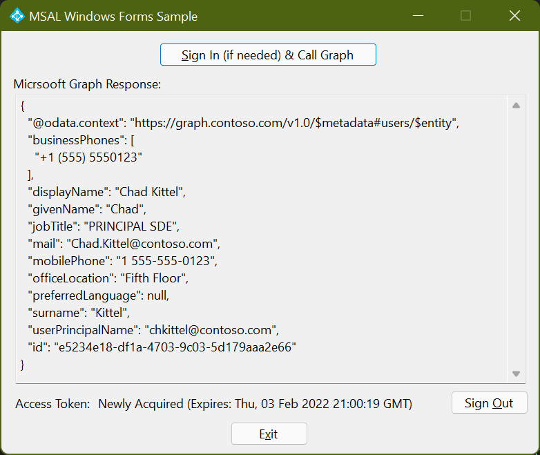

---
# Metadata required by https://docs.microsoft.com/samples/browse/
# Metadata properties: https://review.docs.microsoft.com/help/contribute/samples/process/onboarding?branch=main#add-metadata-to-readme
languages:
- csharp
page_type: sample
name: Windows Forms app that makes a request to the Graph API after signing in the user
description: This .NET 8 Windows Forms app signs in the user and then makes a request to Microsoft Graph for the user's profile data.
products:
- azure
- entra-id
- ms-graph
urlFragment: ms-identity-docs-code-app-csharp-winforms
---

# .NET | Windows Forms | user sign-in, protected web API access (Microsoft Graph) | Microsoft identity platform

This .NET Windows Forms application authenticates a user and then makes a request to the Graph API as the authenticated user. The response to the request is presented to the user.



## Prerequisites

- Microsoft Entra tenant and the permissions or role required for managing app registrations in the tenant.
- Visual Studio 2022, [configured for the .NET 8 desktop development workload](https://docs.microsoft.com/dotnet/desktop/winforms/get-started/create-app-visual-studio?view=netdesktop-8.0#prerequisites)

## Setup

### 1. Register the app

First, complete the steps in [Register an application with the Microsoft identity platform](https://docs.microsoft.com/azure/active-directory/develop/quickstart-register-app) to register the application.

Use these settings in your app registration.

| App registration <br/> setting  | Value for this sample app                                           | Notes                                                                           |
|--------------------------------:|:--------------------------------------------------------------------|:--------------------------------------------------------------------------------|
| **Name**                        | `dotnet-winforms`                                                   | Suggested value for this sample. <br/> You can change the app name at any time. |
| **Supported account types**     | **Accounts in this organizational directory only (Single tenant)**  | Suggested value for this sample.                                                |
| **Platform type**               | **Mobile and desktop applications**                                 | Required value for this sample                                                  |
| **Redirect URIs**               | `http://localhost`                                                  | Required value for this sample                                                  |

> :information_source: **Bold text** in the tables above matches (or is similar to) a UI element in the Microsoft Entra admin center, while `code formatting` indicates a value you enter into a text box in the Microsoft Entra admin center.

### 2. Open the project in Visual Studio

Next, open the _MsalExamples.csproj_ project in Visual Studio.

### 3. Update code sample in _MainWindow.cs_ with app registration values

Finally, set the following values in _MainWindow.cs_.

```csharp
// Enter the tenant ID obtained from the Microsoft Entra admin center
TenantId = "Enter the client ID obtained from the Microsoft Entra admin center",

// Enter the client ID obtained from the Microsoft Entra admin center
ClientId = "Enter the tenant ID obtained from the Microsoft Entra admin center"
```

## Run the application

Run the application by pressing **F5** in Visual Studio.

The appliction will open allowing you to click the **Sign In (if needed) & Call Graph** button to use the authentication flow.


## About the code

This .NET 8 Windows Forms application presents a button that initiates an authentication flow using the Microsoft Authentication Library (MSAL). The user completes this flow in their default web browser. Upon successful authentication, an HTTP GET request to the Microsoft Graph /me endpoint is issued with the user's access token in the HTTP header. The response from the GET request is then displayed to the user. The MSAL client first looks to its token cache, refreshing if necessary, before acquiring a new access token.

## Reporting problems

### Sample app not working?

If you can't get the sample working, you've checked [Stack Overflow](http://stackoverflow.com/questions/tagged/msal), and you've already searched the issues in this sample's repository, open an issue report the problem.

1. Search the [GitHub issues](../../issues) in the repository - your problem might already have been reported or have an answer.
1. Nothing similar? [Open an issue](../../issues/new) that clearly explains the problem you're having running the sample app.

### All other issues

> :warning: WARNING: Any issue in this repository _not_ limited to running one of its sample apps will be closed without being addressed.
For all other requests, see [Support and help options for developers | Microsoft identity platform](https://learn.microsoft.com/entra/identity-platform/developer-support-help-options).

## Contributing

If you'd like to contribute to this sample, see [CONTRIBUTING.MD](/CONTRIBUTING.md).

This project has adopted the [Microsoft Open Source Code of Conduct](https://opensource.microsoft.com/codeofconduct/). For more information, see the [Code of Conduct FAQ](https://opensource.microsoft.com/codeofconduct/faq/) or contact [opencode@microsoft.com](mailto:opencode@microsoft.com) with any additional questions or comments.
