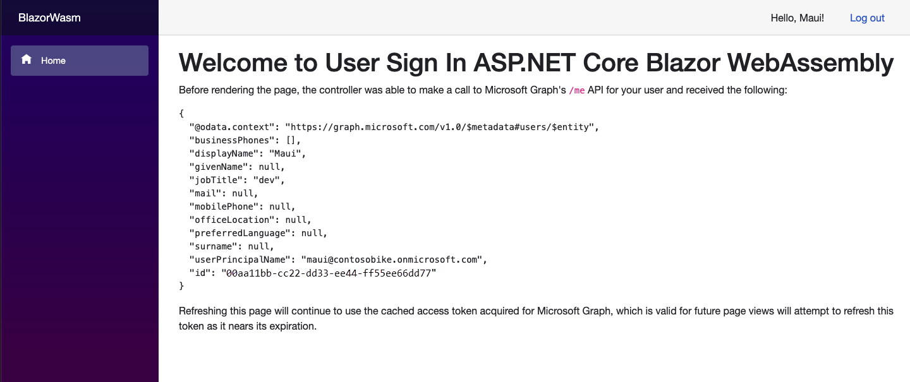
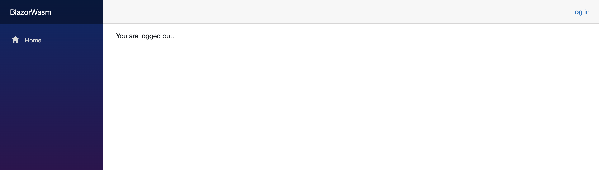

---
# Metadata required by https://docs.microsoft.com/samples/browse/
# Metadata properties: https://review.docs.microsoft.com/help/contribute/samples/process/onboarding?branch=main#add-metadata-to-readme
languages:
- csharp
page_type: sample
name: ASP.NET Core 8.0 Blazor WebAssembly that accesses Microsoft Graph
description: This ASP.NET Core 8.0 Blazor WebAssembly that signs in and contacts Microsoft Graph on behalf of the user. The code in this sample is used by one or more articles on docs.microsoft.com.
products:
- azure
- entra-id
- ms-graph
urlFragment: ms-identity-docs-code-spa-blazor-wasm-csharp
---

# ASP.NET Core 8.0 Blazor WebAssembly | standalone  app | user sign-in, protected web API access (Microsoft Graph) | Microsoft identity platform

The standalone app in this scenario is created using the ASP.NET Core 8.0 Blazor WebAssembly template and modified to allow sign-in with a Microsoft Entra account. It uses the [Microsoft.Authentication.WebAssembly.MSAL](https://www.nuget.org/packages/Microsoft.Authentication.WebAssembly.Msal) package to authenticate users and obtain tokens for calling protected APIs. In other words, the app adds an authentication layer that allows users to sign in with their Work and school accounts and make web API calls to protected resources on their behalf.

> Note: This code sample uses the Microsoft.Authentication.WebAssembly.MSAL package, which is a modified version of the Microsoft.Identity.Client library.



## Prerequisites

- An Azure account with an active subscription. If you don't already have one, [Create an account for free](https://azure.microsoft.com/free/?WT.mc_id=A261C142F).
- [.NET SDK](https://dotnet.microsoft.com/download)

## Setup

<a name='1-register-the-web-api-application-in-your-azure-active-directory'></a>

### 1. Register the web API application in your Microsoft Entra ID

First, complete the steps in [Register an application with the Microsoft identity platform](https://docs.microsoft.com/azure/active-directory/develop/quickstart-register-app) to register the sample app.

Use the following settings for your app registration:

| App registration <br/> setting | Value for this sample app                              | Notes                                                                                                       |
|:------------------------------:|:-------------------------------------------------------|:------------------------------------------------------------------------------------------------------------|
| **Name**                       | `identity-client-app`                                  | Suggested value for this sample. <br/> You can change the app name at any time.                             |
| **Supported account types**    | **Accounts in this organizational directory only (Default Directory only - Single tenant)** | Required for this sample. <br/> Support for the Single tenant.                                              |
| **Platform type**              | `Single-page application`                              | Required value for this sample. <br/> Enables the required and optional settings for the app type.          |
| **Redirect URIs**              | `http://localhost:5000/authentication/login-callback` | Required value for this sample. <br/> You can change that later in your own implementation.                 |

> :information_source: **Bold text** in the table matches (or is similar to) a UI element in the Microsoft Entra admin center, while `code formatting` indicates a value you enter into a text box or select in the Microsoft Entra admin center.

### 2. Configure the web app

1. Open the `BlazorWasm.csproj` under the the `sign-in-blazorwasm` folder in your code editor.
1. Open the `./wwwroot/appsettings.json` file and modify the following code:

    ```JSON
    "Authority": "https://login.microsoftonline.com/Enter the tenant ID obtained from the Microsoft Entra admin center",
    "ClientId": "Enter the client ID obtained from the Microsoft Entra admin center",
    ```

### 3. Install the tooling for ASP.NET Core Blazor

1. Install .NET WebAssembly build tools

   ```bash
   dotnet workload install wasm-tools
   ```

For more information, please refer to [.NET WebAssembly build tools](https://learn.microsoft.com/en-us/aspnet/core/blazor/tooling?view=aspnetcore-8.0&pivots=linux#net-webassembly-build-tools)

## Run the application

### 1. Run the webapp

1. Execute the following command to get the app up and running:

   ```bash
   dotnet run
   ```

### 2. Sign in and sign out the web app

1. Once the web app is listening, navigate to `https://localhost:5001` and enter your credentials. We recommend using a private browser window to avoid conflicts with your current session.


1. Select Logout to sign-out. Once signed out, you can close the browser.



## About the code

This ASP.NET Core Web App is created using .NET Blazor WebAssembly. The app has two main routes, one is public while the another one is requiring the user to be authenticated in Microsoft Entra ID.

When a user logs out, their browser is redirected to a public route confirming the user signed-out. After signing in, and if they've not previously done so, the user is asked to consent to the app's request for permission to access their data.

## Reporting problems

### Sample app not working?

If you can't get the sample working, you've checked [Stack Overflow](http://stackoverflow.com/questions/tagged/msal), and you've already searched the issues in this sample's repository, open an issue report the problem.

1. Search the [GitHub issues](../../issues) in the repository - your problem might already have been reported or have an answer.
1. Nothing similar? [Open an issue](../../issues/new) that clearly explains the problem you're having running the sample app.

### All other issues

> :warning: WARNING: Any issue _not_ limited to running this or another sample app will be closed without being addressed.

For all other requests, see [Support and help options for developers | Microsoft identity platform](https://learn.microsoft.com/azure/active-directory/develop/developer-support-help-options).

## Contributing

If you'd like to contribute to this sample, see [CONTRIBUTING.MD](/CONTRIBUTING.md).

This project has adopted the [Microsoft Open Source Code of Conduct](https://opensource.microsoft.com/codeofconduct/). For more information, see the [Code of Conduct FAQ](https://opensource.microsoft.com/codeofconduct/faq/) or contact [opencode@microsoft.com](mailto:opencode@microsoft.com) with any additional questions or comments.
