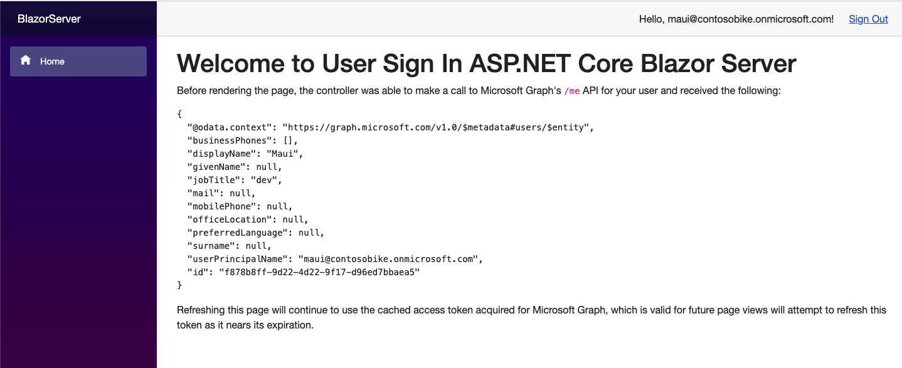

<!-- Keeping yaml frontmatter commented out for now
---
# Metadata required by https://docs.microsoft.com/samples/browse/
# Metadata properties: https://review.docs.microsoft.com/help/contribute/samples/process/onboarding?branch=main#add-metadata-to-readme
languages:
- csharp
page_type: sample
name: "Blazor Server application app that makes a request to the Graph API after signing in the user"
description: "This ASP.NET Core 6 Blazor Server application app signs in the user and then makes a request to Microsoft Graph for the user's profile data."
products:
- azure
- azure-active-directory
- ms-graph
urlFragment: ms-identity-docs-code-app-csharp-blazorserver
---
-->

# ASP.NET Core | Blazor Server application | user sign-in, protected web API access (Microsoft Graph) | Microsoft identity platform

<!-- Build badges here
  
-->

This ASP.NET Core Blazor Server application application authenticates a user and then makes a request to the Graph API as the authenticated user. The response to the request is presented to the user.



## Prerequisites

- Azure Active Directory (Azure AD) tenant and the permissions or role required for managing app registrations in the tenant.
- [.NET 6.0 SDK](https://dotnet.microsoft.com/download/dotnet/6.0)

## Setup

### 1. Register the app

First, complete the steps in [Register an application with the Microsoft identity platform](https://docs.microsoft.com/azure/active-directory/develop/quickstart-register-app) to register the application.

Use these settings in your app registration.

| App registration <br/> setting  | Value for this sample app                                           | Notes                                                                           |
|--------------------------------:|:--------------------------------------------------------------------|:--------------------------------------------------------------------------------|
| **Name**                        | `active-directory-dotnet-blazorserver`                              | Suggested value for this sample. <br/> You can change the app name at any time. |
| **Supported account types**     | **Accounts in this organizational directory only (Single tenant)**  | Suggested value for this sample.                                                |
| **Platform type**               | **Web**                                                             | Required value for this sample                                                  |
| **Redirect URIs**               | `http://localhost:5000/signin-oidc`                                 | Required value for this sample                                                  |

> :information_source: **Bold text** in the tables above matches (or is similar to) a UI element in the Azure portal, while `code formatting` indicates a value you enter into a text box in the Azure portal.

### 2. Open the project in your code editor

Next, open the _Api.csproj_ project under the the sign-in-blazorserver folder in your code editor.

### 3. Update code sample in _appsettings.json_ with app registration values

Finally, set the following values in _appsettings.json_.

```json
"TenantId": "[Enter 'common', or 'organizations' or the Tenant ID (Obtained from the Azure portal. Select 'Endpoints' from the 'App registrations' blade and use the GUID in any of the URLs), e.g. da41245a5-11b3-996c-00a8-4d99re19f292]",
"ClientId": "[Enter the Client Id (Application ID obtained from the Azure portal), e.g. ba74781c2-53c2-442a-97c2-3d60re42f403]",
"ClientSecret": "[Copy the client secret added to the app from the Azure portal]",
```

## Run the application

### 1. Run the webapp

1. Execute the following command to get the app up and running:

   ```bash
   dotnet run
   ```

### 2. Signin into the Blazor Server application

1. Once the web app is listening, navigate to https://localhost:5001 and enter tour credentials

   

1. Click Sign Out

   


## About the code

This ASP.NET Core 6 Blazor Server application is created using .NET Blazor Server. The app is requiring the user to be authenticated in Azure Active Directory.

When users navigates the home page, the application initiates an authentication flow using the Microsoft Authentication Library (MSAL). The user completes this flow in their default web browser. Upon successful authentication, an HTTP GET request to the Microsoft Graph /me endpoint is issued with the user's access token in the HTTP header. The response from the GET request is then displayed to the user.

When a user logs out, their browser is redirected to a public route confirming the user signed-out.

## Reporting problems

### Sample app not working?

If you can't get the sample working, you've checked [Stack Overflow](http://stackoverflow.com/questions/tagged/msal), and you've already searched the issues in this sample's repository, open an issue report the problem.

1. Search the [GitHub issues](/issues) in the repository - your problem might already have been reported or have an answer.
1. Nothing similar? [Open an issue](/issues/new) that clearly explains the problem you're having running the sample app.

### All other issues

> :warning: WARNING: Any issue in this repository _not_ limited to running one of its sample apps will be closed without being addressed.

For all other requests, see [Support and help options for developers | Microsoft identity platform](https://docs.microsoft.com/azure/active-directory/develop/developer-support-help-options).

## Contributing

If you'd like to contribute to this sample, see [CONTRIBUTING.MD](/CONTRIBUTING.md).

This project has adopted the [Microsoft Open Source Code of Conduct](https://opensource.microsoft.com/codeofconduct/). For more information, see the [Code of Conduct FAQ](https://opensource.microsoft.com/codeofconduct/faq/) or contact [opencode@microsoft.com](mailto:opencode@microsoft.com) with any additional questions or comments.
