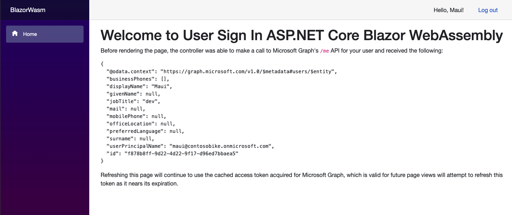

---
# Metadata required by https://docs.microsoft.com/samples/browse/
# Metadata properties: https://review.docs.microsoft.com/help/contribute/samples/process/onboarding?branch=main#add-metadata-to-readme
languages:
- csharp
page_type: sample
name: "ASP.NET Core 6.0 Blazor WebAssembly that accesses Microsoft Graph"
description: "This ASP.NET Core 6.0 Blazor WebAssembly that sign-in and contacts Microsoft Graph on behalf of the user. The code in this sample is used by one or more articles on docs.microsoft.com."
products:
- azure
- azure-active-directory
- ms-graph
urlFragment: ms-identity-docs-code-csharp
---
# ASP.NET Core 6.0 Blazor WebAssembly | standalone  app | user sign-in, protected web API access (Microsoft Graph) | Microsoft identity platform

<!-- Build badges here
  
-->

The standalone app in this scenario has been created using the ASP.NET Core 6.0 Blazor WebAssembly template, and slightly modified to be secured with Azure Active Directory. To lite up Authentication to use Work or School Accounts (SingleOrg), the app uses the [Microsoft Authentication Library (Microsoft.Authentication.WebAssembly.Msal)](https://www.nuget.org/packages/Microsoft.Authentication.WebAssembly.Msal). The package provides a set of primitives that help the app authenticate users and obtain tokens to call protected APIs.  In other words, a simple standalone app is secured by adding an authentication layer allowing users to sign-in with their Work and school accounts, and as a result it can make web API calls to protected resources on behalf of the signed-in user.

The response to the request is presented to the user.



> :page_with_curl: This sample application backs one or more technical articles on docs.microsoft.com. <!-- TODO: Link to first tutorial in series when published. -->

## Prerequisites

- An Azure Active Directory (Azure AD) tenant. You can [open an Azure account for free](https://azure.microsoft.com/free) to get an Azure AD instance.
- [.NET 6.0 SDK](https://dotnet.microsoft.com/download/dotnet/6.0)

## Setup

### 1. Register the web API application in your Azure Active Directory

First, complete the steps in [Register an application with the Microsoft identity platform](https://docs.microsoft.com/azure/active-directory/develop/quickstart-register-app) to register the sample app.

Use the following settings for your app registration:

| App registration <br/> setting | Value for this sample app                              | Notes                                                                                                       |
|:------------------------------:|:-------------------------------------------------------|:------------------------------------------------------------------------------------------------------------|
| **Name**                       | `active-directory-dotnet-blazorwasm-aspnetcore`        | Suggested value for this sample. <br/> You can change the app name at any time.                             |
| **Supported account types**    | **My organization only**                               | Required for this sample. <br/> Support for the Single tenant.                                              |
| **Platform type**              | `Single-page application`                              | Required value for this sample. <br/> Enables the required and optional settings for the app type.          |
| **Redirect URIs**              | `https://localhost:5001/authentication/login-callback` | Required value for this sample. <br/> You can change that later in your own implementation.                 |

> :information_source: **Bold text** in the table matches (or is similar to) a UI element in the Azure portal, while `code formatting` indicates a value you enter into a text box or select in the Azure portal.

<details>
   <summary>:computer: Alternative: Register the application using az-cli</summary>

1. Register a new Azure AD App with a reply url

   ```bash
   AZURE_AD_APP_CLIENT_ID_BLAZORWASM=$(az ad app create --display-name "active-directory-dotnet-blazorwasm-aspnetcore" --query appId -o tsv) && \
   AZURE_AD_APP_OBJECT_ID_BLAZORWASM=$(az ad app show --id $AZURE_AD_APP_CLIENT_ID_BLAZORWASM --query objectId -o tsv) && \
   az rest --method PATCH --uri https://graph.microsoft.com/v1.0/applications/${AZURE_AD_APP_OBJECT_ID_BLAZORWASM} --headers 'Content-Type=application/json' --body '{"spa":{"redirectUris":["https://localhost:5001/authentication/login-callback"]}}'
   ```

</details>

### 2. Configure the web app

1. Open the `BlazorWasm.csproj` under the the `sign-in-blazorwasm` folder in your code editor.
1. Open the `./wwwroot/appsettings.json` file and modify the following code:

    ```json
    "Authority": "https://login.microsoftonline.com/[Enter the Tenant Id Value From Azure Portal]",
    "ClientId": "[Enter the Client Id (Application ID obtained from the Azure portal), e.g. ba74781c2-53c2-442a-97c2-3d60re42f403]",
    ```

<details>
   <summary>:computer: Alternative: modify the `appsettings.json` file from your terminal</summary>

1. Create the `appsettings.json` file with the Azure AD app configuration

   ```bash
   cat > ./wwwroot/appsettings.json <<EOF
   {
     "AzureAd": {
       "Authority": "https://login.microsoftonline.com/$(az account show --query tenantId --output tsv)",
       "ClientId": "${AZURE_AD_APP_CLIENT_ID_BLAZORWASM}"
     }
   }
   EOF
   ```

</details>

### 3. Install the tooling for ASP.NET Core Blazor

1. Install .NET WebAssembly build tools

   ```bash
   dotnet workload install wasm-tools
   ```

   :link: For more information, please take a look [.NET WebAssembly build tools](https://docs.microsoft.com/en-us/aspnet/core/blazor/tooling?view=aspnetcore-6.0&pivots=linux#net-webassembly-build-tools)

## Run the application

### 1. Run the webapp

1. Execute the following command to get the app up and running:

   ```bash
   dotnet run
   ```

### 2. Signin into the web app

1. Once the web app is listening, navigate to https://localhost:5001 and enter tour crendentials


1. Click Logout


### 3. Clean up

1. Delete the Azure AD app

   ```bash
   az ad app delete --id $AZURE_AD_APP_CLIENT_ID_BLAZORWASM
   ```

## About the code

This ASP.NET Core Web App is created using .NET Blazor WebAssembly. The app has two main routes, one is public while the another one is requiring the user to be authenticated in Azure Active Directory.

When a user logs out, their browser is redirected to a public route confirming the user signed-out. After signing in, and if they've not previously done so, the user is asked to consent to the app's request for permission to access their data.

## Reporting problems

### Sample app not working?

If you can't get the sample working, you've checked [Stack Overflow](http://stackoverflow.com/questions/tagged/msal), and you've already searched the issues in this sample's repository, open an issue report the problem.

1. Search the [GitHub issues](../../issues) in the repository - your problem might already have been reported or have an answer.
1. Nothing similar? [Open an issue](../../issues/new) that clearly explains the problem you're having running the sample app.

### All other issues

> :warning: WARNING: Any issue _not_ limited to running this or another sample app will be closed without being addressed.

For all other requests, see [Support and help options for developers | Microsoft identity platform](https://docs.microsoft.com/azure/active-directory/develop/developer-support-help-options).

## Contributing

If you'd like to contribute to this sample, see [CONTRIBUTING.MD](/CONTRIBUTING.md).

This project has adopted the [Microsoft Open Source Code of Conduct](https://opensource.microsoft.com/codeofconduct/). For more information, see the [Code of Conduct FAQ](https://opensource.microsoft.com/codeofconduct/faq/) or contact [opencode@microsoft.com](mailto:opencode@microsoft.com) with any additional questions or comments.

### Others

1. Create the app on your own

   ```bash
   dotnet new blazorwasm --pwa --auth SingleOrg --aad-instance "https://login.microsoftonline.com/" --client-id ${AZURE_AD_APP_CLIENT_ID_BLAZORWASM} --tenant-id $(az account show --query tenantId --output tsv) --called-api-url "https://graph.microsoft.com/v1.0/me"
   ```
