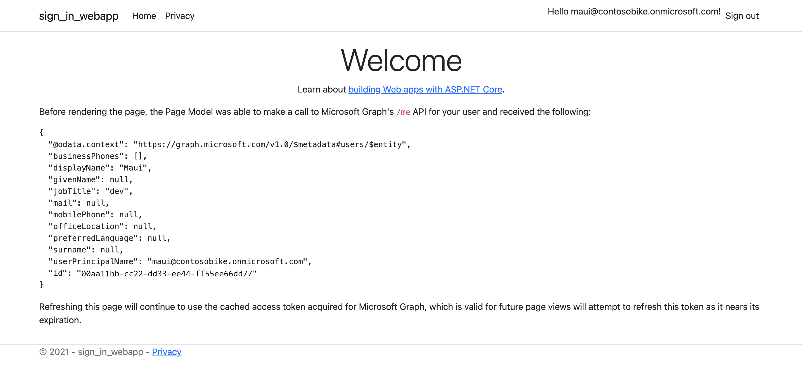

---
# Metadata required by https://docs.microsoft.com/samples/browse/
# Metadata properties: https://review.docs.microsoft.com/help/contribute/samples/process/onboarding?branch=main#add-metadata-to-readme
languages:
- csharp
page_type: sample
name: "ASP.NET Core 8.0 Web App Sign-in user"
description: "This is a ASP.NET Core 8.0 Web App that sign-in users. The code in this sample is used by one or more articles on docs.microsoft.com."
products:
- azure
- entra-id
- ms-graph
urlFragment: ms-identity-docs-code-csharp-sign-in
---

# ASP.NET Core 8.0 Web App - Sign-in user | Microsoft identity platform

This web app, built with ASP.NET Core 8.0 Razor, has added sign-in features. It uses the [OpenID Connect](https://docs.microsoft.com/en-us/entra/identity-platform/v2-protocols-oidc) and [ASP.NET Core Identity](https://docs.microsoft.com/en-us/aspnet/core/security/authentication/identity?view=aspnetcore-8.0) for authentication. This allows users to sign in with their Microsoft Entra accounts. Once signed in, the app can access protected resources on the user’s behalf.

## Quickstart and tutorial guides for this sample

- For a quickstart experience that gets you started fast, see [Quickstart: Sign in users and call the Microsoft Graph API from an ASP.NET Core web app](https://learn.microsoft.com/entra/identity-platform/quickstart-web-app-dotnet-core-sign-in).

- For a in-depth tutorial that walks you through this sample from start to finish, see [Tutorial: Sign in users and call the Microsoft Graph API from an ASP.NET Core web app](https://docs.microsoft.com/entra/identity-platform/tutorial-web-app-dotnet-register-app).

## Prerequisites

- An Azure account with an active subscription. If you don't already have one, [Create an account for free](https://azure.microsoft.com/free/?WT.mc_id=A261C142F).
- [.NET 8.0 SDK](https://dotnet.microsoft.com/download)

## Setup

### 1. Register the web API application in your Microsoft Entra ID

First, complete the steps in [Register an application with the Microsoft identity platform](https://docs.microsoft.com/entra/identity-platform/tutorial-web-app-dotnet-register-app) to register a web application in the Microsoft identity platform.

Use the following settings for your app registration:

| App registration <br/> setting | Value for this sample app                          | Notes                                                                                                       |
|:------------------------------:|:---------------------------------------------------|:------------------------------------------------------------------------------------------------------------|
| **Name**                      | `identity-client-web-app`                          | Suggested value for this sample. <br/> You can change the app name at any time.                           |
| **Supported account types**   | **My organization only**                           | Required for this sample. <br/> Support for the Single tenant.                         |
| **Platform type**             | `Web`                                              | Required value for this sample. <br/> Enables the required and optional settings for the app type.               |
| **Redirect URIs**             | `https://localhost:5001/signin-oidc`               | Required value for this sample.|
| **Front-channel logout URL**  | `https://localhost:5001/signout-oidc`              | Required value for this sample.|
| **CertificateThumbprint**     | _Value shown in Microsoft Entra admin center_      | Required value for this sample.|

> :information_source: **Bold text** in the table matches (or is similar to) a UI element in the [Microsoft Entra admin center](https://entra.microsoft.com/#home), while `code formatting` indicates a value you enter into a text box or select in the Microsoft Entra admin center.

### 2. Configure the web app

1. Open the _~/sign-in-webapp/WebApp.csrpoj_ in your code editor.
1. Open the _appsettings.json_ file and modify the following code:

    ```json
      "Instance": "https://login.microsoftonline.com/",
      "TenantId": "Enter the tenant ID obtained from the Microsoft Entra admin center",
      "ClientId": "Enter the client ID obtained from the Microsoft Entra admin center",
      "ClientCertificates": [
        {
          "SourceType": "StoreWithThumbprint",
          "CertificateStorePath": "CurrentUser/My",
          "CertificateThumbprint": "Enter the certificate thumbprint obtained the Microsoft Entra admin center"
        }   
      ],
    ```

## Run the application

### 1. Run the webapp

1. Execute the following command to get the app up and running:

   ```bash
   dotnet run
   ```

### 2. Sign in to the web app

1. Once the web app is listening, navigate to https://localhost:5001
1. Sign-in with your user credentials.



### 3. Sign out

1. Select Sign out


## About the code

The ASP.NET Core 8.0 Web App will allow users to sign-in, so it can retrieve a Security Token scoped specifically for the Microsoft Graph API, and will use that token to access the user's information. For more information about the proposed scenario, please take a look at the following diagram:

:link: For more information about how to proctect your projects, please let's take a look at https://docs.microsoft.com/en-us/azure/active-directory/develop/sample-v2-code. To know more about how this sample has been generated, please visit https://docs.microsoft.com/en-us/aspnet/core/tutorials/razor-pages/?view=aspnetcore-8.0

## Reporting problems

### Sample app not working?

If you can't get the sample working, you've checked [Stack Overflow](http://stackoverflow.com/questions/tagged/msal), and you've already searched the issues in this sample's repository, open an issue report the problem.

1. Search the [GitHub issues](../../issues) in the repository - your problem might already have been reported or have an answer.
1. Nothing similar? [Open an issue](../../issues/new) that clearly explains the problem you're having running the sample app.

### All other issues

> :warning: WARNING: Any issue _not_ limited to running this or another sample app will be closed without being addressed.

For all other requests, see [Support and help options for developers | Microsoft identity platform](https://docs.microsoft.com/azure/active-directory/develop/developer-support-help-options).

## Contributing

If you'd like to contribute to this sample, see [CONTRIBUTING.MD](/CONTRIBUTING.md).

This project has adopted the [Microsoft Open Source Code of Conduct](https://opensource.microsoft.com/codeofconduct/). For more information, see the [Code of Conduct FAQ](https://opensource.microsoft.com/codeofconduct/faq/) or contact [opencode@microsoft.com](mailto:opencode@microsoft.com) with any additional questions or comments.
