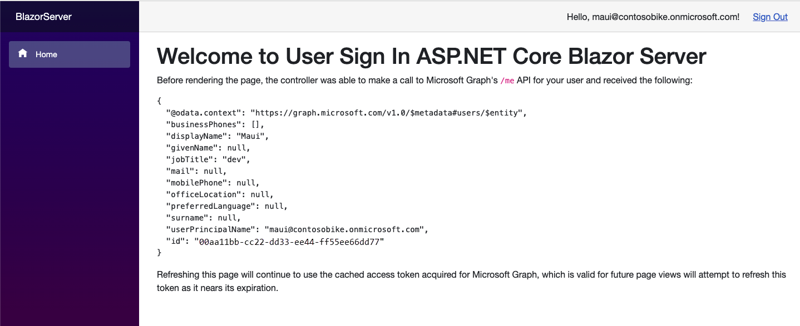
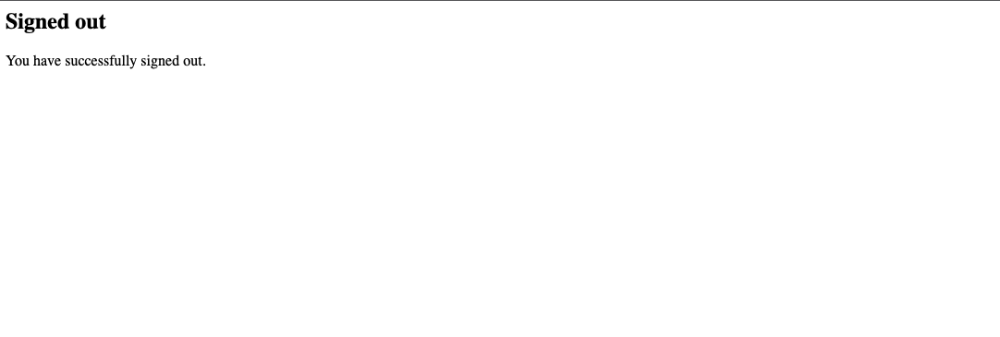

---
# Metadata required by https://docs.microsoft.com/samples/browse/
# Metadata properties: https://review.docs.microsoft.com/help/contribute/samples/process/onboarding?branch=main#add-metadata-to-readme
languages:
- csharp
page_type: sample
name: Blazor Server application app that makes a request to the Graph API after signing in the user
description: This ASP.NET Core 6 Blazor Server application app signs in the user and then makes a request to Microsoft Graph for the user's profile data.
products:
- azure
- entra-id
- ms-graph
urlFragment: ms-identity-docs-code-app-csharp-blazorserver
---

<!-- SAMPLE ID: DOCS-CODE-017 -->
# ASP.NET Core | Blazor Server application | user sign-in, protected web API access (Microsoft Graph) | Microsoft identity platform

<!-- Build badges here
  
-->

This ASP.NET Core Blazor Server application application authenticates a user and then makes a request to the Graph API as the authenticated user. The response to the request is presented to the user.



## Prerequisites

- Microsoft Entra tenant and the permissions or role required for managing app registrations in the tenant.
- [.NET 6.0 SDK](https://dotnet.microsoft.com/download/dotnet/6.0)

## Setup

### 1. Register the app

First, complete the steps in [Register an application with the Microsoft identity platform](https://docs.microsoft.com/azure/active-directory/develop/quickstart-register-app) to register the application.

Use these settings in your app registration.

| App registration <br/> setting  | Value for this sample app                                           | Notes                                                                           |
|--------------------------------:|:--------------------------------------------------------------------|:--------------------------------------------------------------------------------|
| **Name**                        | `active-directory-dotnet-blazorserver`                              | Suggested value for this sample. <br/> You can change the app name at any time. |
| **Supported account types**     | **Accounts in this organizational directory only (Single tenant)**  | Suggested value for this sample.                                                |
| **Platform type**               | **Web**                                                             | Required value for this sample                                                  |
| **Redirect URIs**               | `http://localhost:5000/signin-oidc`                                 | Required value for this sample                                                  |

> :information_source: **Bold text** in the tables above matches (or is similar to) a UI element in the Azure portal, while `code formatting` indicates a value you enter into a text box in the Azure portal.

### 2. Open the project in your code editor

Next, open the _Api.csproj_ project under the the sign-in-blazorserver folder in your code editor.

### 3. Update application code with app registration values

In _appsettings.json_, update each variable with values from the app registration you created earlier.

```json
"TenantId": "[Enter 'common', or 'organizations' or the Tenant ID obtained from the Azure portal]",
"ClientId": "[Enter the Client Id (Application ID) obtained from the Azure portal]",
"ClientSecret": "[Copy the client secret added to the app from the Azure portal]",
```

## Run the application

### 1. Run the webapp

1. Execute the following command to get the app up and running:

   ```bash
   dotnet run
   ```

### 2. Signin into the Blazor Server application

1. Once the web app is listening, navigate to https://localhost:5001. Click the Sign In button and complete the login process.

   

1. Click Sign Out

   


## About the code

This ASP.NET Core 6 Blazor Server application is created using the .NET Blazor Server App template. The app is adding sign-in to protect itself, and as a consequence this is requiring the user to be authenticated in Microsoft Entra ID.

When this .NET Blazor Server starts and before listening for any HTTP requests, it bootstraps the application using a single-surface API provided as part of **Microsoft.Identity.Web** and **Microsoft.Idenitty.Web.UI**. The former is tying ASP.NET Core, its authentication middleware for sign-in, and the [Microsoft Authentication Library (MSAL) for .NET](https://github.com/azuread/microsoft-authentication-library-for-dotnet), while the latter adds UI components and controllers to facilitate user sign-in, sign-out, and other account experiences. All the details required for authentication are being gathered from a configuration section named `AzureAd` as well as others entries used during the call to a protected API, like the scopes. As for authorization, it is using the default policy options. Additionally, special services are injected [specifically for Blazor for re-signing, consent and Conditional Access purposes](https://github.com/AzureAD/microsoft-identity-web/wiki/Managing-incremental-consent-and-conditional-access#in-blazor-server). The recommended pattern to acquire tokens is first attempting to acquire them [non-interactevelly (or silent from cache), and then interactively](https://docs.microsoft.com/azure/active-directory/develop/msal-authentication-flows#interactive-and-non-interactive-authentication). Therefore, it is required to store the tokens for them to be cached. In this tutorial tokens are being stored in memory.

When users navigate to the home page, the application initiates an authentication flow, more specifically an **Authorization code type flow (OAuth 2 authorization code grant)**. During this authentication flow, the user is prompted for their credentials, by Microsoft Entra ID, if the token has to be acquired interactively, and then asked to consent to the permissions. Upon successful authentication, this web app is making a call to the Microsoft Graph /me endpoint from the **Index** page by using an injected **IDownstreamWebApi** service. This helper facilitates making an HTTP GET request to the protected web API adding the cached or newly acquired user's access token in the HTTP Authorization header. The app displays that you've successfully logged in using your Microsoft Entra credentials, and the Microsoft Graph API response.

When a user logs out, their browser is redirected to a public route confirming the user signed-out.

## Reporting problems

### Sample app not working?

If you can't get the sample working, you've checked [Stack Overflow](https://stackoverflow.com/questions/tagged/msal), and you've already searched the issues in this sample's repository, open an issue report the problem.

1. Search the [GitHub issues](/issues) in the repository - your problem might already have been reported or have an answer.
1. Nothing similar? [Open an issue](/issues/new) that clearly explains the problem you're having running the sample app.

### All other issues

> :warning: WARNING: Any issue in this repository _not_ limited to running one of its sample apps will be closed without being addressed.

For all other requests, see [Support and help options for developers | Microsoft identity platform](https://docs.microsoft.com/azure/active-directory/develop/developer-support-help-options).

## Contributing

If you'd like to contribute to this sample, see [CONTRIBUTING.MD](/CONTRIBUTING.md).

This project has adopted the [Microsoft Open Source Code of Conduct](https://opensource.microsoft.com/codeofconduct/). For more information, see the [Code of Conduct FAQ](https://opensource.microsoft.com/codeofconduct/faq/) or contact [opencode@microsoft.com](mailto:opencode@microsoft.com) with any additional questions or comments.
