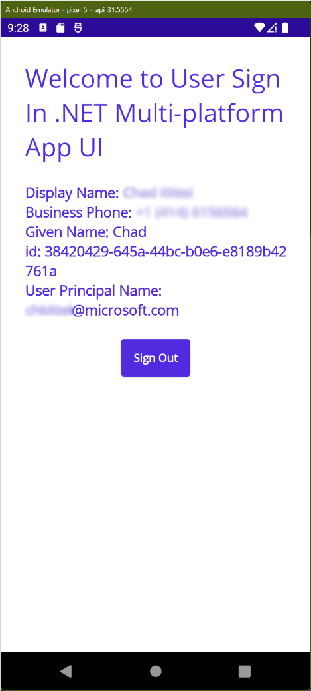

---
# Metadata required by https://docs.microsoft.com/samples/browse/
# Metadata properties: https://review.docs.microsoft.com/help/contribute/samples/process/onboarding?branch=main#add-metadata-to-readme
languages:
- csharp
page_type: sample
name: .NET MAUI Multi-platform App Sign-in user
description: This .NET Multi-platform App UI (.NET MAUI) app signs in the user and then makes a request to Microsoft Graph for the user's profile data. The code in this sample is used by one or more articles on docs.microsoft.com.
products:
- azure
- entra-id
- ms-graph
- dotnet-maui
urlFragment: ms-identity-docs-code-csharp-maui
---

<!-- SAMPLE ID: DOCS-CODE-029 (desktop) and DOCS-CODE-035 (mobile) -->
# .NET MAUI Multi-platform App - Sign-in user | Microsoft identity platform

<!-- Build badges here
  
-->

This sample demonstrates a Windows desktop and Android mobile .NET MAUI Multi-platform App that sign-in users by using the `Microsoft.Identity.Client`.



> :page_with_curl: This sample application backs one or more technical articles on docs.microsoft.com. <!-- TODO: Link to first tutorial in series when published. -->

## Prerequisites

- A Microsoft Entra tenant. You can [open an Azure account for free](https://azure.microsoft.com/free) to get a Microsoft Entra instance.
- [.NET 6.0 SDK](https://dotnet.microsoft.com/download/dotnet/6.0)
- [.NET MAUI](https://docs.microsoft.com/en-us/dotnet/maui/get-started/installation)
- **Install apps from any source** enabled in Windows' developer settings
- [Device Emulators are configured](https://docs.microsoft.com/en-us/dotnet/maui/get-started/first-app)

## Setup

<a name='1-register-the-web-api-application-in-your-azure-active-directory'></a>

### 1. Register the web API application in your Microsoft Entra ID

First, complete the steps in [Register an application with the Microsoft identity platform](https://docs.microsoft.com/azure/active-directory/develop/quickstart-register-app) to register the sample app.

Use the following settings for your app registration:

| App registration <br/> setting | Value for this sample app                                           | Notes                                                                                                       |
|-------------------------------:|:--------------------------------------------------------------------|:------------------------------------------------------------------------------------------------------------|
| **Name**                       | `active-directory-dotnet-xplat-maui`                                | Suggested value for this sample. <br/> You can change the app name at any time.                             |
| **Supported account types**    | **Accounts in this organizational directory only (Single tenant)**  | Required for this sample. <br/> Support for the Single tenant.                                              |
| **Platform type**              | `Mobile and desktop applications`                                   | Required value for this sample. <br/> Enables the required and optional settings for the app type.          |
| **Redirect URI**               | `https://login.microsoftonline.com/common/oauth2/nativeclient`      | Required value for this sample. <br/> You can change that later in your own implementation.                 |

> :information_source: **Bold text** in the table matches (or is similar to) a UI element in the Microsoft Entra admin center, while `code formatting` indicates a value you enter into a text box or select in the Microsoft Entra admin center.

### 2. Configure the MAUI app

1. Open the _sign-in-xplat/MainPage.xaml.cs_ in your code editor.

    ```csharp
    private const string ClientId = "APPLICATION_(CLIENT)_ID";
    private const string Tenant = "TENANT_ID";
    ```

1. Open the _sign-in-xplat/Platforms/Android/AndroidManifest.xml_ in your code editor and replace the `APPLICATION_(CLIENT)_ID` placeholder with your Application (Client) Id.

    ```xml
    <application android:allowBackup="true" android:icon="@mipmap/appicon" android:roundIcon="@mipmap/appicon_round">
      <activity android:name="microsoft.identity.client.BrowserTabActivity"  android:exported="true">
        <intent-filter>
          ...
          <data android:scheme="msalAPPLICATION_(CLIENT)_ID" android:host="auth" />
        </intent-filter>
      </activity>
    </application>
    ```

## Run the application

### 1. Run the .NET MAUI App

#### Android

1. Select target Android emulator and then press `F5`.

#### Windows

1. Select **Windows Machine** and then press `F5`.

### 2. Signin into the app

1. Once the app is running you can sign-in with your user credentials.


## About the code


This app uses the .NET MAUI Multi-platform App UI to provide a cross-platform experience in which the Microsoft Identity Client library is used to sign the user in and out of the application.

When a signed-out user clicks the sign in button, the app offers a native Microsoft Entra sign-in experience. After signing in, and if they've not previously done so, the user is asked to consent to the app's request for permission to access their data.

While signing in, a new token is acquired and passed in an Authorization header as Bearer for a subsequent call to Microsoft Graph. When a signed-out user the account is removed from the client cleaning up the user's retrieved information.

This cross-platform solution makes use of conditional compilation so that code is targeted to specific platforms when required.

## Reporting problems

### Sample app not working?

If you can't get the sample working, you've checked [Stack Overflow](http://stackoverflow.com/questions/tagged/msal), and you've already searched the issues in this sample's repository, open an issue report the problem.

1. Search the [GitHub issues](../../../../issues) in the repository - your problem might already have been reported or have an answer.
1. Nothing similar? [Open an issue](LINK_HERE) that clearly explains the problem you're having running the sample app.

### All other issues

> :warning: WARNING: Any issue _not_ limited to running this or another sample app will be closed without being addressed.

For all other requests, see [Support and help options for developers | Microsoft identity platform](https://docs.microsoft.com/azure/active-directory/develop/developer-support-help-options).

## Contributing

If you'd like to contribute to this sample, see [CONTRIBUTING.MD](/CONTRIBUTING.md).

This project has adopted the [Microsoft Open Source Code of Conduct](https://opensource.microsoft.com/codeofconduct/). For more information, see the [Code of Conduct FAQ](https://opensource.microsoft.com/codeofconduct/faq/) or contact [opencode@microsoft.com](mailto:opencode@microsoft.com) with any additional questions or comments.
